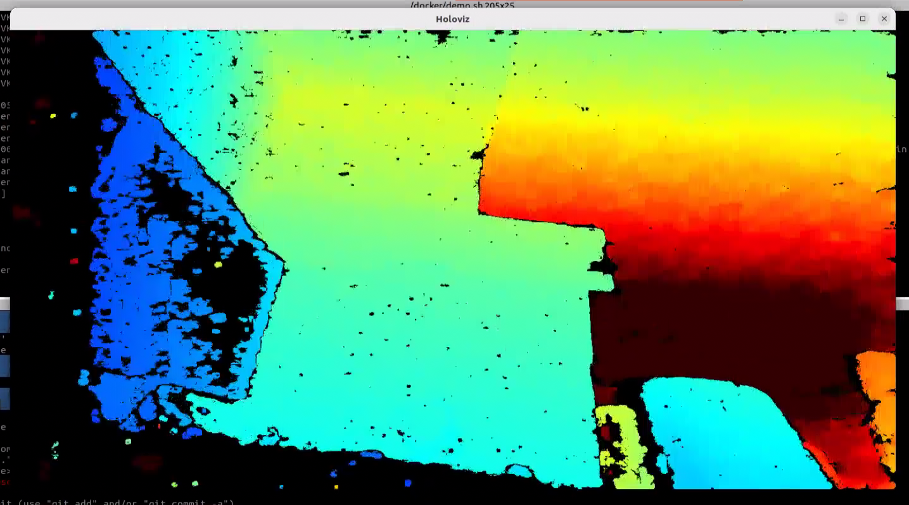
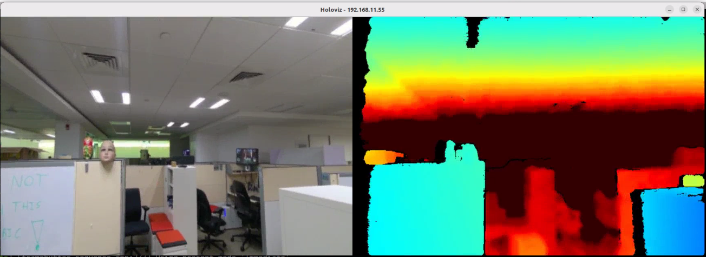

# realsense-sipl

RealSense depth cameras on NVIDIA Jetson through **SIPL/UDDF** and the **Holoscan Sensor
Bridge (HSB)**, covering two independent camera paths:

| Path | Camera | Transport | Where it lives |
| --- | --- | --- | --- |
| **D457 over GMSL** | RealSense D457 (DS5 ASIC + OV9282) | MAX9295A serializer → MAX96712 deserializer → Tegra CSI | `d457-sipl/` |
| **D555 over CoE** | RealSense D555 (HKR SoC) | Camera-over-Ethernet via the Holoscan Sensor Bridge | `d555-sipl/` |

Both deliver frames to Holoscan applications through the vendored
[`holoscan-sensor-bridge/`](holoscan-sensor-bridge/).





---

## Two independent projects

`d457-sipl` and `d555-sipl` are **separate projects that share this repository**. They target
different Jetson releases whose SIPL config APIs are mutually exclusive, so neither can be built
from the other's configuration:

| Project | Jetson release | SIPL config API | Rig |
| --- | --- | --- | --- |
| `d555-sipl` | L4T **R38** | `CameraSystemConfig` — the API upstream HSB 2.5.0 targets | `rs-hsb-thor` |
| `d457-sipl` | L4T **R39.2** | `sensorconfig::SensorSystemConfig`, which replaced it | `fw-advantech-thor-1` |

`holoscan-sensor-bridge/` is therefore kept at (near) upstream 2.5.0 and carries **no
camera-specific code**. Each project keeps its own Holoscan operators, examples and wiring under
`<project>/hsb/`, and `tools/graft_hsb.sh` overlays exactly one of them onto an HSB checkout before
building:

```sh
tools/graft_hsb.sh d457      # or: d555
tools/graft_hsb.sh --check   # report which project is currently grafted
```

Graft one project at a time; the script refuses to stack one on the other. This is the
single-repository equivalent of how the projects used to be kept apart — one superproject branch
each, pinning the HSB submodule to a different HSB branch.

## Repository layout

| Path | Contents |
| --- | --- |
| `d457-sipl/` | **D457 over GMSL (R39.2).** The SIPL/UDDF camera-module driver, query plugin, cdi-mgr device-tree overlay, DS5 register tables, SerDes SDK patches, its Holoscan code in `hsb/`, rig tools and tests |
| `holoscan-sensor-bridge/` | Vendored NVIDIA Holoscan Sensor Bridge 2.5.0 (Apache-2.0), kept near upstream — shared infrastructure only, no camera-specific code — see [`REALSENSE-FORK-NOTICE.md`](holoscan-sensor-bridge/REALSENSE-FORK-NOTICE.md) |
| `d555-sipl/` | **D555 over CoE (R38).** The UDDF module/sensor drivers, the CoE/HSB transport, its PyHSL sequences, and its Holoscan code in `hsb/` |
| `resources/` | Screenshots and misc assets |

---

## Building

Everything here targets **aarch64 Jetson**; none of it builds on an x86 host.
The commands below were exercised on a Jetson Thor (Advantech MIC-742, L4T R39.2,
kernel 6.8.12-tegra) with g++ 13.3 and cmake 3.28.

### D457 SIPL driver, deserializer and query plugin

Needs the Jetson SIPL SDK source tree on the device (`.../usr/src/jetson_sipl_api/sipl`).

```sh
# from a checkout of this repository, on the Jetson
d457-sipl/tools/build_deploy.sh -r "$PWD"
```

That syncs the driver sources into the SDK tree, applies the MAX9295/MAX96712 patches, builds
`libuddf_d457cameramodule_library.so`, `libnvuddf_max96712_library.so` and
`libnvsipl_qry_d457.so`, and installs them into `/usr/lib/nvsipl_drv`.
`-c driver,deser,query` selects a subset; see the header of the script for the rest.

For the multi-camera configuration, also apply the four SerDes diffs in
`d457-sipl/sdk-patches/multicam-patches/` to the SDK tree before building — see
[`d457-sipl/sdk-patches/multicam-patches/README.md`](d457-sipl/sdk-patches/multicam-patches/README.md).

### D555 UDDF driver (camera over Ethernet)

```sh
cmake -S d555-sipl -B build/d555
cmake --build build/d555 -j"$(nproc)"
```

Produces `libnvuddf_realsense_library.so` (D555 module + sensor + CoE/HSB transport). The Jetson
Camera SIPL SDK is not vendored — the build uses the copy installed on the device; pass
`-DSIPL_ROOT=/path/to/sipl` to point elsewhere. See [`d555-sipl/README.md`](d555-sipl/README.md).

### Holoscan Sensor Bridge

Built inside the HSB container (`hololink-demo:2.5.0`):

```sh
cd holoscan-sensor-bridge
sh docker/demo.sh bash -c '
  cmake -S . -B build -DCCCL_DIR:PATH=/usr/local/cuda/targets/sbsa-linux/lib/cmake/cccl -DHOLOLINK_BUILD_SIPL=1 &&
  cmake --build build -j"$(nproc)"'
```

Graft a project first (`tools/graft_hsb.sh d457` or `d555`) — the tree itself carries no camera
code. See `holoscan-sensor-bridge/docs/user_guide/thor-jp7-setup.md` for the full
device-setup prerequisites.

---

## Running

The D457 players and rig helpers live in `d457-sipl/tools/`. They expect two things from the
environment rather than hardcoding them:

- `RIG_SUDO_PW` — the device's sudo password, for non-interactive `sudo`. Leave it unset to use
  a cached/NOPASSWD sudo instead.
- `VNC_PW` — the password to install for the VNC server the viewer scripts start.

Stream selection is by environment variable: `D457_STREAM=depth|rgb|ir` for a single stream and
`D457_STREAMS=depth,rgb,ir` for the multi-stream players; `D555_STREAM` for the D555 player.

---

## License

This repository is Apache-2.0 — see [`LICENSE`](LICENSE). Third-party code keeps its own notices:

| Path | License |
| --- | --- |
| `holoscan-sensor-bridge/` | Apache-2.0 — a modified snapshot of NVIDIA's Holoscan Sensor Bridge, retaining its `LICENSE` and copyright headers ([fork notice](holoscan-sensor-bridge/REALSENSE-FORK-NOTICE.md)) |
| `d555-sipl/hololink/core/` | Apache-2.0 — NVIDIA, from the Holoscan Sensor Bridge |
| `d555-sipl/fmt/` | MIT — [fmtlib/fmt](https://github.com/fmtlib/fmt) |

The **NVIDIA Jetson Camera SIPL SDK is not included**. It is distributed under
`LicenseRef-NvidiaProprietary`, which prohibits redistribution without an express agreement with
NVIDIA, so both `d457-sipl/` and `d555-sipl/` build against the copy installed on the Jetson
rather than vendoring it.

> The four SerDes drivers we had to change more deeply (`MAX9295.{cpp,hpp}`, `MAX967XX.cpp`,
> `MAX967XXHsl.py`) are **not** committed either. They are NVIDIA's code with our edits, so only the
> diffs are kept, in `d457-sipl/sdk-patches/multicam-patches/`, alongside an `apply.sh` that
> reproduces them against a stock SDK tree.
